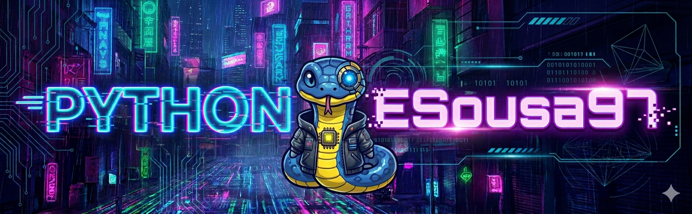

<div align="center">
<h1>py-rag-engine</h1>

<p>End-to-end Python RAG (Retrieval-Augmented Generation) engine: PDF / Markdown <strong>ingestion</strong>, recursive and <strong>semantic chunking</strong>, embeddings via <strong>LM Studio</strong> (or any OpenAI-compatible endpoint), <strong>PostgreSQL + pgvector</strong> with HNSW cosine index, <strong>hybrid search</strong> (dense ANN + Postgres FTS) fused with <strong>Reciprocal Rank Fusion</strong>, <strong>Cross-Encoder re-ranking</strong>, a <strong>FastAPI</strong> REST API, offline <strong>RAGAS</strong> evaluation, and structured tests on Python 3.11 / 3.12.</p>

  

  <br>

[](https://github.com/esousa97/py-rag-engine/actions/workflows/ci.yml)
[](https://github.com/esousa97/py-rag-engine/actions/workflows/codeql.yml)
[](https://github.com/esousa97/py-rag-engine/actions/workflows/ci.yml)
[](https://github.com/esousa97/py-rag-engine/actions/workflows/publish.yml)
[](https://github.com/esousa97/py-rag-engine/blob/main/pyproject.toml)
[](LICENSE)
[](https://github.com/esousa97/py-rag-engine/commits)
[](https://github.com/astral-sh/ruff)
[](https://docs.pytest.org/)
[](https://www.codefactor.io/repository/github/esousa97/py-rag-engine)
[](https://github.com/esousa97/py-rag-engine/blob/main/.pre-commit-config.yaml)

</div>

---

**py-rag-engine** is a small, production-minded **RAG engine**: **ingest** PDF and Markdown files, **chunk** them recursively (with optional embedding-based semantic splitting), **embed** through LM Studio, **store** vectors in PostgreSQL with `pgvector` (HNSW cosine index) alongside a `tsvector` GIN index for full-text search, **retrieve** with three composable stages (dense ANN + Postgres FTS → Reciprocal Rank Fusion → Cross-Encoder re-rank), and optionally **generate** grounded answers via an LM Studio chat model. A **FastAPI** app exposes the whole pipeline behind `/health`, `/documents`, and `/query`. An offline **RAGAS** runner benchmarks chunk size and embedding-model combinations. Canonical repository: `github.com/esousa97/py-rag-engine`.

## Pipeline overview

```
PDF / Markdown
      │
      ▼
  Ingestion ──► Recursive / Semantic Chunking ──► SHA-256 deduplication
      │
      ▼
  Embedding (LM Studio / any OpenAI-compatible endpoint)
      │
      ▼
  PostgreSQL + pgvector  ◄──  HNSW cosine index (bge-m3 · 1024 dims)
                         ◄──  GIN index on tsvector (Postgres FTS)
      │
      ├──► Dense recall  (top-20 via pgvector cosine ANN)
      │
      └──► FTS recall    (top-20 via ts_rank_cd, websearch_to_tsquery)
                │
                ▼
       Reciprocal Rank Fusion (RRF, k=60)
                │
                ▼
  Cross-Encoder re-rank  (ms-marco-MiniLM-L-6-v2, top-5 final)
                │
                ▼
  RerankedResult list ordered by relevance score
```

## Demo (quick smoke test)

Create a virtual environment, install the package, and run a fast wiring check against a small sample document — no Postgres or LM Studio required for the unit suite.

**Linux / macOS (bash)**

```bash
python -m venv .venv
source .venv/bin/activate
pip install -e ".[api,embeddings]"
pip install pytest

pytest -q
```

**Windows (PowerShell)**

```powershell
py -m venv .venv
.\.venv\Scripts\Activate.ps1
pip install -e ".[api,embeddings]"
pip install pytest

python -m pytest -q
```

To exercise the **full pipeline** end-to-end (ingest → embed → store → hybrid search → rerank), spin up Postgres + LM Studio (see "Infrastructure setup" below) and run `python scripts\demo_rerank.py data\gdp_document_0.pdf`. To drive the REST API, run `uvicorn "py_rag_engine.api:create_app" --factory --host 127.0.0.1 --port 8001`. See [docs/architecture.md](docs/architecture.md) and [docs/evaluation.md](docs/evaluation.md) for the full module map and metric definitions.

## Features

| Area | What you get |
| ---- | -------------- |
| Ingestion | **PDF** page extraction via `pypdf` and **Markdown** (`.md` / `.markdown`) loaders with source-aware metadata. |
| Chunking | **Recursive** splitter with dynamic overlap, plus optional **semantic chunking** using cosine similarity between paragraph embeddings. |
| Dedup | **SHA-256** content hash per chunk; upserts on `(embedding_model, content_hash)` keep the table idempotent across re-runs. |
| Storage | **PostgreSQL + pgvector** with HNSW cosine index, JSONB metadata GIN index, and a `tsvector` GIN index for full-text search. |
| Retrieval | **Three-stage**: dense pgvector ANN + Postgres FTS (`ts_rank_cd`, `websearch_to_tsquery`) fused via **Reciprocal Rank Fusion (RRF, k=60)**, then re-ranked by a **Cross-Encoder**. |
| Re-ranking | `CrossEncoderReranker` (default `ms-marco-MiniLM-L-6-v2`) with lazy model loading and an injectable `predict` for tests. |
| Generation | Optional **grounded answer** via an LM Studio chat model (`generate_answer` assembles the prompt + citation contexts). |
| API | **FastAPI** with `/health`, `/documents` (upload + list), and `/query` exposing four retrieval modes via `use_hybrid` / `use_rerank` toggles. |
| Evaluation | Offline **RAGAS** runner with faithfulness / answer relevancy / context precision; outputs a timestamped JSON report and a config ranking. |
| Tests | **84** unit / integration tests on Python 3.11 and 3.12 in CI; integration suite gated on `TEST_POSTGRES_URL` + `LM_STUDIO_BASE_URL`. |

## Tech stack

| Component | Role |
| --------- | ---- |
| Python 3.10+ | Language and runtime (CI runs 3.11 and 3.12) |
| PostgreSQL 16 + pgvector | Vector storage, HNSW cosine ANN, FTS via `tsvector` |
| SQLAlchemy 2 + psycopg 3 | DB engine and connection pool |
| LM Studio (OpenAI-compatible) | Embeddings (`bge-m3`) and chat (`qwen2.5-7b-instruct`) |
| sentence-transformers | Cross-Encoder re-ranking and local semantic embeddings |
| langchain-text-splitters | Recursive character chunking |
| pypdf | PDF page extraction |
| FastAPI + uvicorn | REST API |
| RAGAS (optional) | Faithfulness / answer relevancy / context precision metrics |
| pytest / pytest-cov | Tests and coverage |
| Ruff | Lint + format |

## Prerequisites

| Requirement | Version tested | Notes |
|---|---|---|
| Python | 3.11 / 3.12 / 3.14 | `>=3.10` per `pyproject.toml` |
| PostgreSQL + pgvector | pg16 + pgvector 0.8.2 | via Docker (see below) |
| LM Studio | any | OpenAI-compatible server on `localhost:1234` |
| Embedding model | `gpustack/bge-m3-GGUF` (bge-m3-Q8_0) | 1024d, multilingual |
| Chat model (for eval) | `Qwen/Qwen2.5-7B-Instruct-GGUF` Q4_K_M | ~4.7 GB, recommended for 12 GB GPUs |
| sentence-transformers | 5.4.x | Cross-Encoder re-ranking + local embeddings |
| Git LFS | any | to clone the Cross-Encoder weights |

No external job/database server beyond Postgres is required; the API and CLI scripts are stateless.

## Installation and usage

### From source (recommended)

```bash
git clone https://github.com/esousa97/py-rag-engine.git
cd py-rag-engine
pip install -e ".[api,embeddings]"
# add ".[eval]" too if you plan to run the RAGAS evaluation
```

### Development install (editable)

```bash
pip install -e ".[api,embeddings,eval]"
pip install pytest
```

### PyPI

There is **no PyPI publish workflow yet** — install from source as shown above. A `publish.yml` workflow would build wheels/sdists on release and upload them via PyPI trusted publishing; the badge link above is wired so that any future publish workflow renders without further edits.

**Dependency review** is a recommended CI add-on (via `actions/dependency-review-action`) and would run on every pull request alongside lint and tests. The current `ci.yml` runs the test matrix only.

## Quick Start

### 1. Postgres + pgvector via Docker

```powershell
$env:POSTGRES_PASSWORD = "<choose-a-strong-password>"
$env:POSTGRES_DB       = "rag"
$env:POSTGRES_PORT     = "5434"

docker run -d `
  --name rag-pgvector `
  -e POSTGRES_PASSWORD=$env:POSTGRES_PASSWORD `
  -e POSTGRES_DB=$env:POSTGRES_DB `
  -p "$($env:POSTGRES_PORT):5432" `
  pgvector/pgvector:pg16
```

### 2. LM Studio — embedding + chat model

Install [LM Studio](https://lmstudio.ai), download `gpustack/bge-m3-GGUF` (embeddings) and `Qwen/Qwen2.5-7B-Instruct-GGUF` Q4_K_M (chat, for grounded answers / evaluation), load **both** in **Developer → Local Server**, and click **Start Server**. Verify:

```powershell
Invoke-RestMethod http://localhost:1234/v1/models | Select-Object -ExpandProperty data | Format-Table id
```

### 3. Run the REST API

```powershell
$env:EVAL_POSTGRES_URL     = "postgresql+psycopg://postgres:$env:POSTGRES_PASSWORD@localhost:5434/rag"
$env:LM_STUDIO_BASE_URL    = "http://localhost:1234"
$env:LM_STUDIO_EMBED_MODEL = "text-embedding-bge-m3"
$env:LM_STUDIO_CHAT_MODEL  = "qwen2.5-7b-instruct"

.venv\Scripts\python.exe -m uvicorn "py_rag_engine:api.create_app" --factory --host 127.0.0.1 --port 8001
```

### 4. Drive it with curl

```bash
# Health
curl -s http://127.0.0.1:8001/health
# {"status":"ok","postgres":"ok","lm_studio":"ok"}

# Ingest
curl -X POST "http://127.0.0.1:8001/documents?chunk_size=1024" \
     -F "file=@data/gdp_document_0.pdf"

# Hybrid + Cross-Encoder rerank + grounded answer
curl -X POST http://127.0.0.1:8001/query -H "Content-Type: application/json" \
  -d '{"question":"How does HNSW work in pgvector?","top_k":3,
       "use_hybrid":true,"use_rerank":true,"generate_answer":true}'
```

### Retrieval modes (single endpoint)

| `use_hybrid` | `use_rerank` | Mode | Score returned |
|---|---|---|---|
| `false` | `false` | `dense` (pgvector ANN only) | cosine similarity |
| `true`  | `false` | `hybrid` (dense + FTS via RRF) | RRF score |
| `false` | `true`  | `dense_rerank` (cosine + Cross-Encoder) | rerank score |
| `true`  | `true`  | `hybrid_rerank` (RRF + Cross-Encoder) | rerank score |

### End-to-end demo CLI

```powershell
python scripts\demo_rerank.py data\gdp_document_0.pdf `
  --query "What is the geotechnical investigation methodology used in this report?" `
  --reranker-model "$PWD\.cache\ms-marco-MiniLM-L-6-v2"
```

## Resilience (LM Studio retries)

The `LMStudioClient` wraps every embedding / chat call with retries on `OSError`, `WinError 10054` (Windows socket reset under load), and malformed JSON, using exponential backoff tuned via `LMStudioConfig.retries` and `LMStudioConfig.backoff`. Failed calls are logged and surface to the API as `502` / `503` responses. Tune behaviour via env vars and the wiring in [`src/py_rag_engine/clients/lm_studio.py`](src/py_rag_engine/clients/lm_studio.py) and [`src/py_rag_engine/api/routes.py`](src/py_rag_engine/api/routes.py).

## Documentation

| Document | Contents |
| -------- | -------- |
| [LICENSE](LICENSE) | MIT License |
| [docs/architecture.md](docs/architecture.md) | Module map, pipeline diagram, data flow |
| [docs/evaluation.md](docs/evaluation.md) | RAGAS metrics, run modes, report schema |
| [`pyproject.toml`](pyproject.toml) | Build config, optional extras (`api`, `embeddings`, `eval`), Ruff settings |

## Project layout

| Path | Role |
| ---- | ---- |
| `src/py_rag_engine/config.py` | `LMStudioConfig` / `PostgresConfig` / `EvalConfig` (env-driven) |
| `src/py_rag_engine/clients/lm_studio.py` | `LMStudioClient` HTTP wrapper + `detect_chat_model` |
| `src/py_rag_engine/domain.py` | `DocumentChunk`, `ChunkMetadata` |
| `src/py_rag_engine/vector_math.py` | `cosine_similarity` (numpy) |
| `src/py_rag_engine/ingestion/` | PDF + Markdown loaders, `ingest_file` / `ingest_path` orchestration |
| `src/py_rag_engine/chunking/` | Recursive splitter with dynamic overlap; embedding-based semantic splitting |
| `src/py_rag_engine/embeddings/` | SHA-256 hashing, `make_lm_studio_embed`, `make_sentence_transformer_embed` |
| `src/py_rag_engine/storage/postgres.py` | `PostgresEmbeddingStore` (pgvector HNSW + Postgres FTS) |
| `src/py_rag_engine/retrieval/hybrid.py` | `retrieve_hybrid`, `reciprocal_rank_fusion` |
| `src/py_rag_engine/retrieval/rerank.py` | `CrossEncoderReranker`, `rerank_candidates` |
| `src/py_rag_engine/retrieval/service.py` | `retrieve_with_rerank`, `retrieve_hybrid_with_rerank` |
| `src/py_rag_engine/api/` | FastAPI factory + lifespan, REST routes, Pydantic schemas |
| `src/py_rag_engine/generation/lm_studio_chat.py` | `generate_answer` grounded in context |
| `src/py_rag_engine/evaluation/` | Gold-standard loader, metrics, official-RAGAS adapter, `EvalRunner` |
| `scripts/demo_rerank.py` | E2E demo CLI (dense + Cross-Encoder rerank) |
| `scripts/demo_hybrid.py` | Hybrid Search demo CLI (dense vs FTS vs RRF) |
| `scripts/eval_ragas.py` | Offline RAGAS CLI |
| `scripts/process_document.py` | Standalone chunking CLI |
| `data/` | Sample PDF metadata, eval document, gold-standard Q&A |
| `tests/` | `pytest` suite (chunking, ingestion, storage, retrieval, API, evaluation) |
| `.github/workflows/ci.yml` | CI: pytest matrix on Python 3.11 / 3.12 |

## Tests

```bash
pip install -e ".[api,embeddings]"
pip install pytest
pytest -q
```

```text
83 passed, 1 skipped
```

The single skipped test is `tests/test_postgres_integration.py`, which is gated on `TEST_POSTGRES_URL` + `LM_STUDIO_BASE_URL` and embeds three sentences round-trip through pgvector.

### Integration test (full round-trip)

```powershell
$env:POSTGRES_PASSWORD         = "<your-password>"
$env:TEST_POSTGRES_URL         = "postgresql+psycopg://postgres:$env:POSTGRES_PASSWORD@localhost:5434/rag"
$env:LM_STUDIO_BASE_URL        = "http://localhost:1234"
$env:LM_STUDIO_EMBEDDING_MODEL = "text-embedding-bge-m3"
$env:STORAGE_EMBEDDING_MODEL   = "bge-m3"
python -m pytest -q
```

### Coverage

```bash
pip install -e ".[api,embeddings]"
pip install pytest pytest-cov
pytest --cov=py_rag_engine --cov-report=term-missing
```

## Offline RAGAS evaluation

`scripts/eval_ragas.py` runs the full pipeline against a 10-question gold-standard set and writes a JSON report comparing chunk sizes and embedding models. Three metrics are computed per question — **faithfulness**, **answer relevancy**, **context precision** — and an `overall_ranking` block ranks configurations by mean score.

| Mode | Env var | Configs × Questions | Wall time¹ |
|---|---|---|---|
| Smoke (sanity check) | `EVAL_SMOKE=1` | 1 × 1 | ~30 s |
| Quick (single model, 3 Qs) | `EVAL_QUICK=1 EVAL_SKIP_MINILM=1` | 3 × 3 | ~3 min |
| Full single-model | `EVAL_SKIP_MINILM=1` | 3 × 10 | ~8 min |
| Full comparison | _(no flags)_ | 6 × 10 | ~15 min |

¹ Qwen2.5-7B-Instruct Q4_K_M on RTX 3060 12 GB. See [docs/evaluation.md](docs/evaluation.md) for the full metric definitions and report schema.

## Contributing

Issues and pull requests are welcome. Run `pytest -q` and `ruff check src tests` before opening a PR; keep modules single-purpose and prefer extending existing scripts over adding new top-level entry points.

## Changelog

Tracked via GitHub releases and the [commit history](https://github.com/esousa97/py-rag-engine/commits).

## License

[MIT](LICENSE).

<div align="center">

## Author

**Enoque Sousa**

[](https://www.linkedin.com/in/enoque-sousa-bb89aa168/)
[](https://github.com/esousa97)
[](https://enoquesousa.vercel.app)

**[⬆ Back to Top](#py-rag-engine)**

Made with ❤️ by [Enoque Sousa](https://github.com/esousa97)

**Project status:** Study project

</div>
